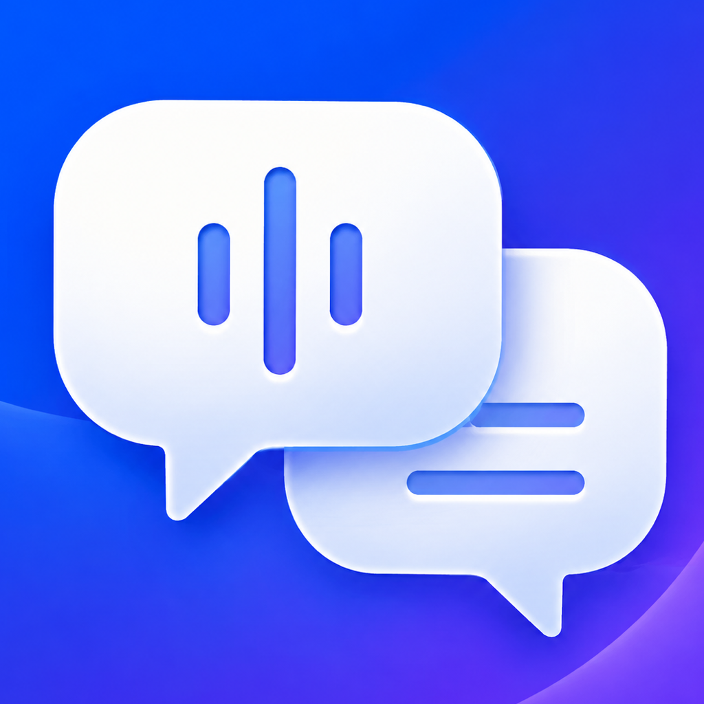

# LiveTranslate

[English](README.md) | [简体中文](README.zh-CN.md)

<p align="center">
  
</p>

LiveTranslate 是一个注重隐私的 iOS 26 概念验证项目，用于将系统允许捕获的其他 App 音频转换为实时双语字幕。它通过 ReplayKit 获取系统提供的 App 音频，在设备端完成语音识别和翻译，并通过画中画（PiP）窗口在用户切换到其他 App 后继续显示最新字幕。

> [!IMPORTANT]
> LiveTranslate 是个人概念验证项目，不是正式产品或 App Store 发行版本。完整的 ReplayKit、Speech、Translation 与 PiP 链路必须在 iPhone 真机上验证；模拟器构建和单元测试无法证明真机系统音频捕获与语言模型行为正常。

## 核心特点

- 为 iOS 允许 ReplayKit 捕获的音频来源生成跨 App 字幕。
- 在 PiP 悬浮窗口中同时显示原文与译文。
- 使用 `SpeechAnalyzer` 和 `SpeechTranscriber` 在设备端进行语音识别。
- 使用 `TranslationSession` 在设备端完成翻译。
- 根据当前设备和 iOS 版本动态读取可用的输入、输出语言。
- 仅在用户明确点击后按需下载模型；切换语言不会静默下载资源。
- 不使用服务器、账号、第三方 SDK、分析或遥测。
- 不上传、不保存原始音频。
- 只保留最新字幕快照，不保存完整字幕历史。

## 工作原理

```text
其他 App 的音频
        │
        ▼
ReplayKit Broadcast Upload Extension
        │  .audioApp 音频样本
        ▼
SpeechAnalyzer + SpeechTranscriber
        │  渐进式识别文本
        ▼
字幕分句与翻译任务调度
        │
        ▼
TranslationSession
        │  原文 + 译文
        ▼
App Group 共享字幕快照
        │
        ▼
App 内预览 + PiP 画中画字幕
```

广播扩展负责语音识别和翻译，并将有界的最新字幕快照写入共享 App Group。主 App 监听该快照，在 App 内预览区和 PiP 窗口中进行渲染。

## 环境要求

- 安装 Xcode 26.6 或更高版本的 macOS。
- 一台运行 iOS 26 或更高版本的 iPhone 真机。
- 可用于本地代码签名的 Apple 开发团队。
- 无 DRM 的媒体来源，例如“文件”中的本地视频，或者允许系统录屏的网页媒体。
- 首次下载语言模型时需要网络；模型准备完成后可在设备端使用。

## 构建与安装

1. 克隆仓库并打开 Xcode 工程：

   ```bash
   git clone https://github.com/zhengxueqian01/LiveTranslate.git
   cd LiveTranslate
   open ios/LiveTranslate/LiveTranslate.xcodeproj
   ```

2. 在 Xcode 中依次选择 `LiveTranslate` 和 `LiveTranslateBroadcast` Target。
3. 为两个 Target 启用 **Automatically manage signing**，并选择同一个 Apple 开发团队。
4. 确认两个 Target 使用相同的 App Group：

   ```text
   group.com.xueqianzheng.LiveTranslate
   ```

5. 确认默认 Bundle Identifier；如果当前开发团队无法注册这些标识符，需要同步替换：

   ```text
   主 App：  com.xueqianzheng.LiveTranslate
   广播扩展：com.xueqianzheng.LiveTranslate.BroadcastExtension
   ```

6. 在 Xcode 中选择已经连接的 iPhone，运行 `LiveTranslate` Scheme。

## 使用方法

1. 打开 LiveTranslate，选择音频语言和目标语言。
2. 查看语音识别和翻译资源状态。
3. 如果当前语言组合尚未准备完成，点击“下载所需模型”。
4. 在字幕预览区域打开 PiP 画中画字幕。
5. 点击系统广播按钮，选择 `LiveTranslateBroadcast`，保持麦克风关闭，然后开始广播。
6. 切换到音频来源 App，播放无 DRM 的音频或视频。
7. 使用结束后，通过 iOS 系统广播控件停止广播。

## 隐私设计

LiveTranslate 的字幕处理链路被设计为完全保留在设备端：

- 捕获到的音频在广播扩展中处理。
- 原始音频不会上传或持久化保存。
- 语音识别和翻译模型由 iOS 提供并管理。
- App Group 只保存当前语言配置和最新字幕快照。
- 项目不包含账号系统、应用服务器、分析、广告或遥测。

## 已知限制

- 音频来源是否允许捕获由 ReplayKit 和来源 App 决定，无法保证兼容所有 App。
- DRM 受保护媒体、系统电话、FaceTime、会议 App 和第三方通话可能提供静音样本或完全无法捕获。
- 广播扩展只处理 `.audioApp`，忽略麦克风音频和视频帧。
- 用户必须通过 iOS 系统界面明确启动和停止 ReplayKit 广播。
- 可用语言和具体语言对取决于当前设备、iOS 版本及已安装的系统资源。
- 当前不包含自动语种检测、字幕历史、搜索、导出、云端回退或账号同步。
- 真机延迟、发热、PiP 持续更新和长时间运行稳定性仍需完成真机验收。

## 项目结构

```text
ios/LiveTranslate/
├── LiveTranslate/             SwiftUI 主 App 与 PiP 字幕渲染
├── LiveTranslateBroadcast/    ReplayKit Broadcast Upload Extension
├── Shared/                    语言、字幕、音频和协调逻辑
├── LiveTranslateTests/        单元测试与回归测试
└── LiveTranslate.xcodeproj/   Xcode 工程
```

设计文档和实施计划位于 [`docs/superpowers`](docs/superpowers/) 目录。

## 验证

执行无签名构建：

```bash
xcodebuild \
  -project ios/LiveTranslate/LiveTranslate.xcodeproj \
  -scheme LiveTranslate \
  -destination 'generic/platform=iOS Simulator' \
  CODE_SIGNING_ALLOWED=NO \
  -derivedDataPath /tmp/LiveTranslate-DerivedData \
  build
```

在可用模拟器上运行测试：

```bash
xcodebuild test \
  -project ios/LiveTranslate/LiveTranslate.xcodeproj \
  -scheme LiveTranslate \
  -destination 'platform=iOS Simulator,name=iPhone 17 Pro,OS=latest' \
  -only-testing:LiveTranslateTests \
  -parallel-testing-enabled NO \
  -derivedDataPath /tmp/LiveTranslate-DerivedData
```

自动检查覆盖状态管理、语言配置、模型准备、字幕分句、音频转换、翻译顺序和 PiP 渲染逻辑。完整链路仍需要在已签名的 iPhone 真机上验证。

## 开源许可

LiveTranslate 使用 [MIT License](LICENSE) 开源。
